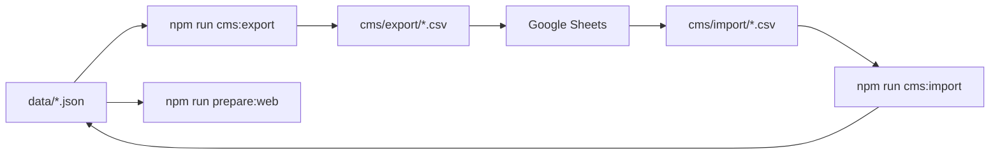

# LexiQuest Google Sheets CMS

Edit vocabulary content in Google Sheets without redeploying code. Export → edit → import → sync.

## Workflow



## 1. Export current content

```bash
npm run cms:export
```

Creates CSV files in `cms/export/`:

| File | Sheet tab | Contents |
|------|-----------|----------|
| `Words.csv` | Words | Master word bank (def, example, syn, ant, tags) |
| `WordLists.csv` | WordLists | List metadata (`grouped` = GRE, `dictionary` = flat) |
| `Groups.csv` | Groups | GRE synonym group titles |
| `GroupWords.csv` | GroupWords | Word membership in GRE groups |
| `DictionaryWords.csv` | DictionaryWords | Flat dictionary list membership |

## 2. Upload to Google Sheets

1. Create a new Google Sheet (e.g. **LexiQuest CMS**).
2. Import each CSV as a separate tab (File → Import → Upload).
3. Share with editors who maintain content.

### Column rules

- **Words.word** — primary key; do not rename lightly (breaks list references).
- **Words.example** — plain text; HTML like `<em>word</em>` is optional.
- **Words.tags** — pipe-separated: `GRE|GMAT|IELTS`.
- **WordLists.listType** — `grouped` (GRE synonym lists) or `dictionary` (flat A–Z banks).
- **DictionaryWords** — one row per word per dictionary list.

## 3. Download edits

After editing in Sheets:

1. Download each tab as CSV (File → Download → Comma-separated values).
2. Place files in `cms/import/` with exact names:
   - `Words.csv`
   - `WordLists.csv`
   - `Groups.csv`
   - `GroupWords.csv`
   - `DictionaryWords.csv`

You can import only `Words.csv` if you only changed definitions/examples.

## 4. Import back to the app

```bash
npm run cms:import
npm run prepare:web
```

This overwrites `data/words-merged.json` and/or `data/word-lists.json`.

## User example overrides (not in CMS)

Students can edit example sentences in the app (stored in `localStorage` as `wordOverrides`). CMS controls the **default** bundled content only.

## Dictionary lists

Add a row to `WordLists.csv` with `listType=dictionary`, then add words in `DictionaryWords.csv`. Run import + `npm run expand:dictionary` is not required if you manage lists fully via CMS.

Quick seed for starter dictionary lists:

```bash
npm run expand:dictionary
```

## Future: live publish

For production without rebuild, host `words-merged.json` and `word-lists.json` on a CDN/Firebase Storage and bump a `contentVersion` in `js/config.js`. The import pipeline stays the same; only the publish step changes.
